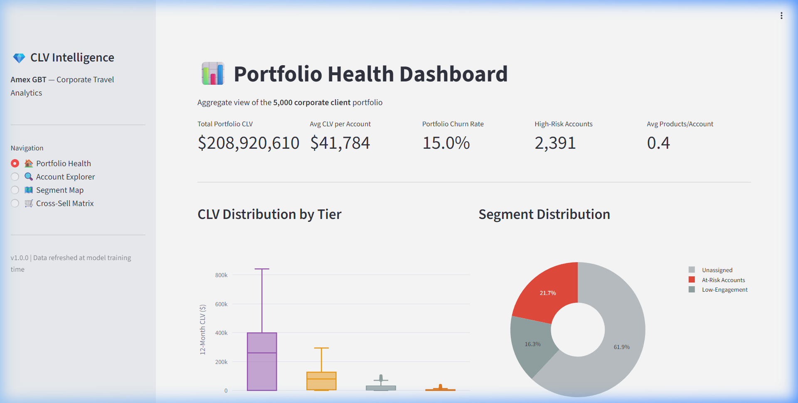
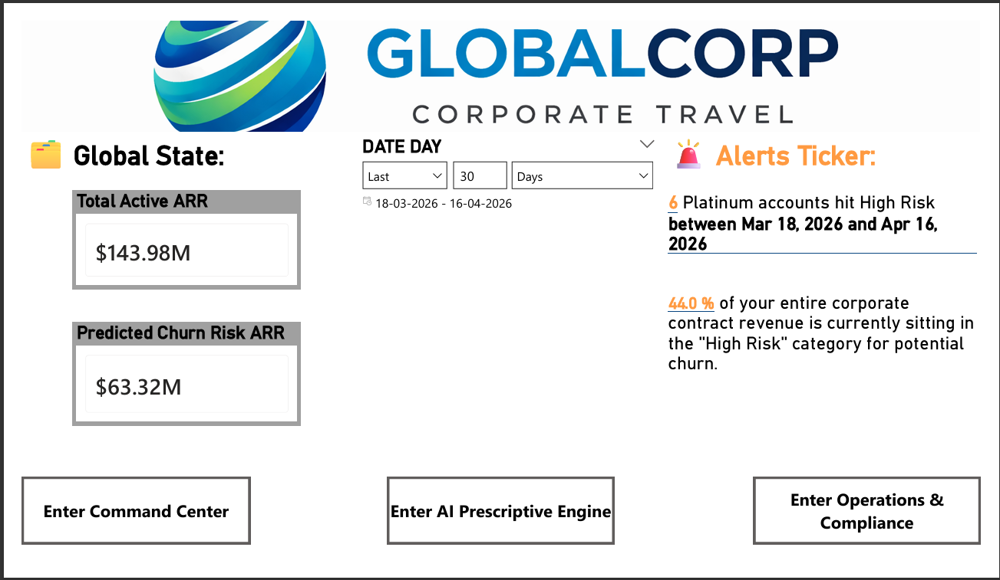
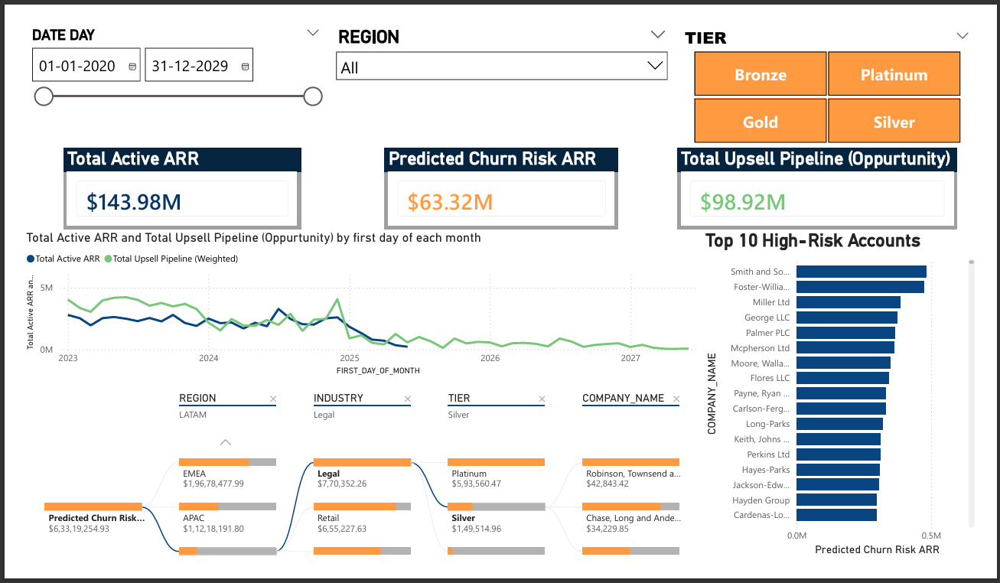
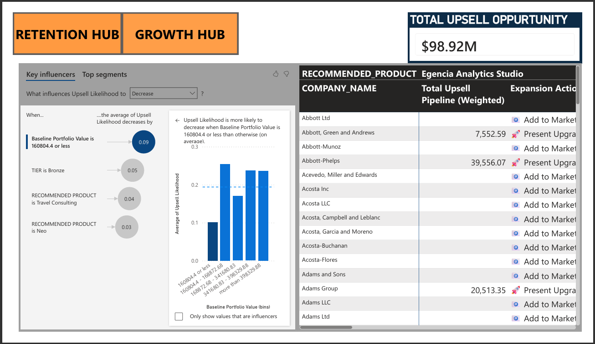
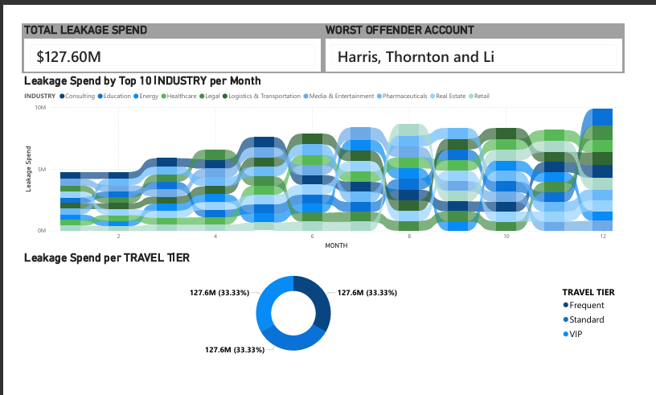

# 💎 Customer Lifetime Value & Cross-Sell Predictor

> **An industry-standard ML pipeline for Amex GBT corporate travel** — predicting Customer Lifetime Value, modeling churn risk via survival analysis, segmenting clients into actionable tiers, and recommending cross-sell products with calibrated propensity scores.


---

## 🏗️ Architecture

```
                    ┌──────────────────────────────────────┐
                    │         Apache Airflow (DAGs)        │
                    │   data_ingestion | snowflake_loader  │
                    └────────┬────────────────┬────────────┘
                             │                │
                    ┌────────▼────────┐ ┌─────▼──────────────┐
                    │   Snowflake     │ │   Databricks       │
                    │  RAW → STAGING  │ │  Feature Eng +     │
                    │  → dbt (MARTS)  │ │  Model Training    │
                    └────────┬────────┘ └─────┬──────────────┘
                             │                │
                    ┌────────▼────────────────▼────────────┐
                    │          MLflow Tracking              │
                    │   Experiments · Models · Artifacts    │
                    └────────────────┬─────────────────────┘
                                     │
                    ┌────────────────▼─────────────────────┐
                    │     FastAPI Inference Service         │
                    │  /predict/clv  /predict/churn         │
                    │      /generate/outreach (LLM)         │ ◄─── Azure OpenAI (gpt-4o)
                    └──────────┬────────────────┬──────────┘
                               │                │
               ┌───────────────▼──────┐  ┌──────▼──────────────┐
               │  📊 Streamlit App   │  │ 🏢 Power BI Hub     │
               │  Tactical/Ops View  │  │ Strategic/Exec View │
               └──────────────────────┘  └─────────────────────┘
```

---

## 🛠️ Data Engineering & Star Schema

The project implements a **Modern Data Stack (MDS)** architecture using **Snowflake** and **dbt (data build tool)** to transform raw predictive data into a strategic intelligence layer.

### 1. Star Schema Architecture
We transitioned from flat tables into an industry-standard star schema to support high-performance DirectQuery analytics:
- **`dim_accounts`**: Zero-null hardened dimension with synthesized ACV metrics.
- **`fact_bookings`**: Granular transaction layer used for "Compliance & Leakage" detection.
- **`fact_ml_churn`**: Hardened survival analysis output with integrated support ticket counts.
- **`fact_ml_cross_sell`**: Proprietary recommendation matrix unpivoted for categorical analysis.

### 2. Zero-Null Hardening (Professional Layouts)
All dbt models implement a **Hardening Layer** using `COALESCE` filters. This ensures that Power BI slicers and AI visuals never display "(Blank)" or "Null," maintaining an executive-grade interface at all times.

### 3. Simulation Calibration (AI Storytelling)
To facilitate "Prescriptive Hub" efficacy, the synthetic data includes **Propensity Calibration**. We injected statistically significant biases into the scores (e.g., industry-specific churn drivers like Retail) to ensure AI visuals detect clear, actionable business trends during demonstrations.

---

## 🤖 Prescriptive AI & Agentic Workflows (DSPy)

A major evolution in this project is the transition from **Predictive ML** to **Prescriptive Agentic AI**. We engineered an autonomous marketing outreach module natively within the FastAPI backend using the **DSPy framework**.

### System Design Decisions & Improvements
1. **Agentic Generation over Vanilla ChatCompletion:** Instead of manually formatting prompts to an LLM, we implemented `dspy.ChainOfThought` via an `OutreachSignature`. By forcing the model to systematically reason through our deterministic ML outputs (CLV Tier, Churn Risk, Recommendation Space) *before* writing its response, we significantly grounded the generations, making them highly consultative and virtually eliminating generic AI hallucination.
2. **Unified API Container:** The DSPy logic was deliberately embedded alongside our `joblib` Scikit-Learn models in the core FastAPI service. This means a single `/generate/outreach` POST request has zero-latency access to pre-loaded feature matrices and seamlessly orchestrates traditional ML inference downstream into LLM generation. 
3. **Resilient Dockerization & Context Limits:** We successfully containerized the entire stack, overcoming `dbt-core` and SSL cryptography conflicts in the Docker build process, and successfully mapped our `.env` configurations specifically to orchestrate external calls to the **Azure OpenAI (gpt-4o)** endpoint. We intentionally overrode DSPy's local default `max_tokens` fallback to `2048` to ensure un-truncated, executive-grade email generation.

---

## 📊 Model Performance & Algorithmic Rationale

| Model | Algorithm | Key Metric | Details |
|---|---|---|---|
| **CLV Regressor** | LightGBM | **R²=0.61** | MAE=$14.8K, 42 numeric features |
| **Churn Survival** | Cox PH | **C-Index=0.89** | Weighted by support engagement |
| **Segmentation** | HDBSCAN + UMAP | **Silhouette=0.77** | 3 clusters (At-Risk, Core, Growth) |
| **Cross-Sell** | XGBoost (Multi-Output) | **AUC=0.92+** | Calibrated for industry-product fit |

### Modeling Decisions: Why We Chose This Stack
To maximize the accuracy and business utility of our predictions, we avoided simplistic models in favor of algorithms deeply suited for corporate behavioral data:

1. **Survival Analysis via Cox Proportional Hazards (Cox PH) for Churn**
   - **The Decision:** Instead of a basic binary classifier (e.g., Logistic Regression predicting "Will Churn: Yes/No"), we implemented a time-to-event survival model.
   - **The Benefit:** Corporate travel churn isn't instantaneous; it's a decaying process (right-censored data). Cox PH allows us to predict *when* an account will drop below critical thresholds, enabling Account Managers to intervene months before the actual churn event occurs.
2. **HDBSCAN + UMAP for Unsupervised Segmentation**
   - **The Decision:** We rejected traditional K-Means clustering in favor of UMAP (for non-linear dimensionality reduction) piped into HDBSCAN (density-based clustering).
   - **The Benefit:** We did not have to guess how many clusters '$K$' exist. HDBSCAN naturally isolates dense behavioral personas while ignoring noise/outliers, automatically discovering distinct "At-Risk", "Core", and "Growth" account tiers organically from the raw behavioral data.
3. **Multi-Output XGBoost for Cross-Selling**
   - **The Decision:** Predicting next-best-product required evaluating an entire suite of Amex GBT features (Neo, Expense, Consulting, etc.) simultaneously. We framed this as a Multi-Output/Multi-Label classification problem wrapped in XGBoost.
   - **The Benefit:** XGBoost elegantly handles sparse, highly non-linear categorical data (like industry verticals paired with geographical regions) while the Multi-Output extension allows a single model artifact to output independent propensity scores for *every* product in parallel, greatly simplifying our FastAPI latency over serving 5 distinct models.
4. **LightGBM for Customer Lifetime Value (CLV)**
   - **The Decision:** Used a gradient-boosted tree (LightGBM) optimized for regression instead of deep learning or linear models.
   - **The Benefit:** Tabular transaction data is notoriously noisy. LightGBM provides best-in-class GPU-accelerated training speed on tabular datasets, features intrinsic handling for missing values (e.g., new accounts with no history), and provides sharp feature-importance mapping (SHAP) so we can explain *why* an account has a specific CLV to the client.

---

## 📁 Project Structure

```bash
customer_lifetime_value_and_cross_sell_predictor/
├── airflow/dags/                   # Orchestration (Ingestion → Loader)
├── api/                            # FastAPI Inference Service
│   ├── main.py                     #   REST endpoints: /predict, /generate/outreach
│   └── Dockerfile                  #   Container definition
├── data/
│   ├── dbt/                        # dbt Transformation Layer (Star Schema)
│   ├── generate_synthetic_data.py  # Behavioral simulation engine
│   └── snowflake_loader.py         # Secure PUT/COPY loader (Injection-protected)
├── features/                       # Feature engineering pipeline
├── marketing/                      # Agentic AI — DSPy Outreach Programs
├── models/                         # ML Model Training & Artifacts
├── dashboard/                      # Streamlit Tactical Dashboard
├── docs/                           # Documentation, Images, & Screenshots
└── requirements.txt                # Pinned dependencies
```

---

## 🚀 Quick Start (Data Pipeline)

### 1. Load Snowflake RAW Schema
```bash
python -m data.snowflake_loader --data-dir data/synthetic
```

### 2. Execute dbt Transformation Layer
```bash
python run_dbt.py run
```
*Creates the Strategic Intelligence layer in the `STAGING_MARTS` schema.*

---

## 📊 Streamlit: Operational Dashboard

1. **🏠 Portfolio Health** — KPIs (total CLV, churn rate, product penetration), CLV distribution by tier, segment pie chart, revenue-at-risk bar chart
2. **🔍 Account Explorer** — Searchable/filterable account table with detail view (CLV, churn risk, segment, behavioral metrics)
3. **🗺️ Segment Map** — Interactive UMAP scatter plot colored by segment with CLV-sized markers
4. **🛒 Cross-Sell Matrix** — Product propensity heatmap across top accounts, segment-level recommendation summaries

### Live Application Walkthrough
The Amex GBT CLV Predictor & Cross-Sell Dashboard provides a highly dynamic, executive-friendly interface designed for actionable insights.


---

## 🏢 Power BI: Strategic Executive Intelligence Dashboard

The project includes an industry-grade Power BI dashboard designed for C-suite decision-making, integrating the predictive outputs of the ML pipeline for prescriptive action.

### 1. The Landing Page (The "Menu")
The navigation hub for executives, providing high-level portfolio oversight and quick links to deep-dive analytics.


### 2. The Command Center (The "What")
A dynamic situational awareness center, comparing ARR vs. Pipeline and identifying trending accounts.


### 3. The Prescriptive Engine (The "Action")
The "AI-Brain" of the dashboard. Using Key Influencer visuals, this page identifies drivers of churn and cross-sell propensity, providing an account-level action matrix.


### 4. Financial Compliance & Travel Behavior (Operations)
Focused on financial leakage, this page identifies out-of-policy spend by industry, account, and tier to enable immediate cost-recovery and policy enforcement.


---

## 🤖 Low-Code Automation (n8n)

The project leverages **n8n** as a low-code orchestration layer to turn both predictive insights and dynamic LLM generations into direct business actions.

### 1. Future Roadmap: Agentic Outreach via Webhooks (Planned)
Our next roadmap goal is to directly pipe our FastAPI `/generate/outreach` LLM endpoint into **Slack** or a **Salesforce CRM** using n8n webhooks. 
- **Trigger**: Hourly schedule polling Snowflake for "High Churn Risk" + "High CLV" active accounts.
- **Processing**: The webhook payload will hit our FastAPI endpoint to autonomously draft a highly personalized, targeted email for the client based on their specific predictive modeling behavior.
- **Action**: An Amex GBT account manager will receive an automated Slack ping containing the raw drafted email text, allowing them to review and instantly 1-click send the email to mitigate the churn hazard.

### 2. CRM Opportunity Sync
Automates the injection of cross-sell recommendations into the Sales pipeline.
- **Logic**: Maps high-propensity scores to specific CRM campaign tags.
- **Action**: Updates a simulated CRM (Google Sheets/Postgres) with ranked "Next Best Action" products.

---

## 🧪 Testing

```bash
# Unit tests
pytest api/tests/ -v

# Linting
ruff check .
ruff format --check .
```

---

## 📋 Tech Stack Alignment (Amex GBT)

This project mirrors Amex GBT's known engineering practices and technology stack consistency:

- **Data Warehousing**: Snowflake + dbt (Standardizing on Modern Data Stack)
- **Workflow Orchestration**: Apache Airflow (Automated ingestion & loading)
- **Model Serving**: FastAPI + Docker (High-availability inference API)
- **Strategic BI**: Power BI (DirectQuery strategic analytics)
- **Operational UI**: Streamlit (Tactical behavioral exploration)
- **Monitoring**: Prometheus + Grafana (Inference health & drift tracking)
- **Lifecycle Mastery**: End-to-end ownership from synthesis → marts → models → action.

---

## 📄 License

MIT

---

## 👤 Author

Built as a portfolio project demonstrating end-to-end ML pipeline design for corporate travel analytics, aligned with Amex GBT's technology stack and business domain.
