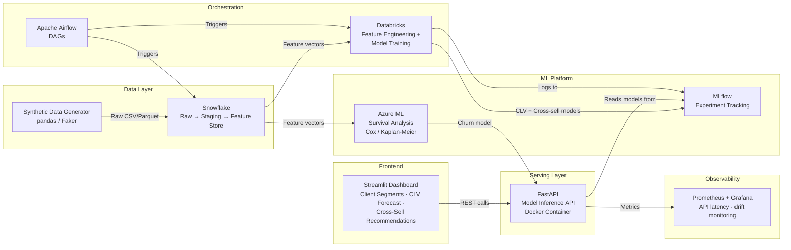
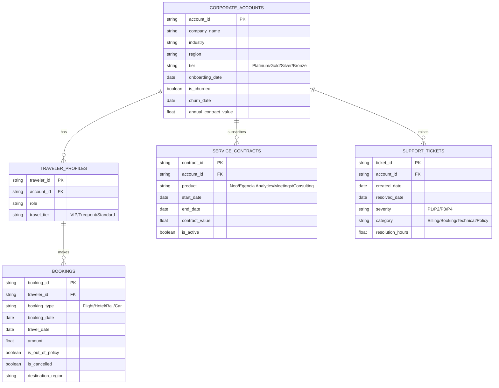

# Customer Lifetime Value (CLV) & Cross-Sell Predictor — Implementation Plan

An industry-standard ML pipeline to predict Customer Lifetime Value and recommend cross-sell services for Amex GBT corporate clients.

---

## Confirmed Decisions

| Decision | Answer |
|---|---|
| Cloud infrastructure | **Real services** — Snowflake, Azure ML, Databricks (free trial credits) |
| Synthetic dataset scale | **5,000 corporate clients**, **~1M transactions** |
| Orchestration & serving | Airflow + FastAPI + Docker (EKS-simulation pattern) ✅ |

---

## Architecture Overview



---

## Tech Stack Detail

| Layer | Technology | Why (Amex GBT Alignment) |
|---|---|---|
| Data warehouse / Feature store | **Snowflake** | Centralized client feature store — service adoption flags, booking volume, churn history |
| Feature engineering & training | **Databricks** (Spark + MLflow) | Scalable feature pipelines; MLflow for experiment tracking |
| Survival analysis | **Azure ML** | Cox PH / Kaplan-Meier for customer tenure prediction |
| Orchestration | **Apache Airflow** | Amex GBT uses Airflow for ETL/ELT pipelines |
| Model serving | **FastAPI + Docker** | Simulates Amex GBT's migration from SageMaker → EKS microservices |
| Frontend | **Streamlit** | Decoupled client calling FastAPI endpoints (not monolithic) |
| Monitoring | **Prometheus + Grafana** | Simulates Datadog-style granular inference monitoring |
| CI/CD | **GitHub Actions** | Linting, pytest, Docker build validation |

---

## Synthetic Data Schema

We will synthesize **5,000 corporate client accounts** generating **~1M transaction records** across the following entity model:



---

## Day-by-Day Execution Plan

### Day 1 — Data Synthesis & Snowflake Ingestion

| Task | Detail |
|---|---|
| Synthesize data | Python script using `pandas` + `Faker` to generate all 5 entities above. Embed realistic distributions — seasonal booking spikes, correlated churn signals, skewed spend distributions. |
| Define CLV proxy | `CLV_12m = Σ(booking_amount) + Σ(contract_value) - Σ(support_cost_proxy)` over a forward 12-month window. |
| Snowflake setup | Create `RAW`, `STAGING`, and `FEATURES` schemas. Load raw CSVs via Snowflake `PUT`/`COPY INTO`. |
| Airflow DAG v1 | DAG: `data_synthesis → snowflake_raw_load → staging_transform`. Schedule: manual trigger. |

**Deliverables**: `data/synthetic/`, `airflow/dags/data_ingestion_dag.py`, Snowflake schemas populated.

---

### Day 2 — Feature Engineering Pipeline (Databricks + Snowflake)

| Feature Group | Features |
|---|---|
| **Recency / Frequency / Monetary (RFM)** | Days since last booking, booking count (30/90/180d windows), total spend per window |
| **Behavioral trajectory** | Booking volume trend (slope), spend acceleration, cancellation rate trend |
| **Service adoption** | Number of active products, product diversity score, contract renewal count |
| **Support health** | Ticket rate per month, avg resolution time, P1/P2 escalation ratio |
| **Policy compliance** | Out-of-policy booking %, policy violation trend |

- Build in **Databricks notebooks** using PySpark.
- Write **computed features back to Snowflake** `FEATURES` schema for point-in-time correct serving.
- Airflow DAG v2: `snowflake_staging → databricks_feature_engineering → snowflake_feature_store`.

**Deliverables**: `databricks/notebooks/feature_engineering.py`, updated Airflow DAG, Snowflake feature tables.

---

### Day 3 — CLV & Churn Modeling

| Model | Method | Platform | Target |
|---|---|---|---|
| **CLV Regressor** | XGBoost (+ LightGBM benchmark) | Databricks | 12-month forward revenue |
| **Churn Survival** | Cox Proportional Hazards + Kaplan-Meier | Azure ML | Time-to-churn probability curve |

- Train/val/test split: 70/15/15 stratified by customer tier.
- Hyperparameter tuning via Optuna (Databricks) and Azure ML HyperDrive.
- **MLflow**: Log all experiments, register best models with staging/production aliases.
- SHAP explanations for CLV model (global + local interpretability).

**Deliverables**: MLflow registered models, `notebooks/clv_model.py`, `notebooks/survival_analysis.py`, SHAP plots.

---

### Day 4 — Client Segmentation (Advanced)

Move beyond vanilla K-Means:

| Step | Method |
|---|---|
| Dimensionality reduction | UMAP on feature set for visualization |
| Clustering | **HDBSCAN** for density-based, noise-aware clustering |
| Segment labeling | Post-hoc business rules mapping clusters to actionable tiers |
| Validation | Silhouette score, Calinski-Harabasz index, segment stability analysis |

**Target segments** (aligned to Amex GBT account management):
1. 🏆 **Platinum Partners** — High CLV, low churn risk, full product adoption
2. 📈 **Growth Accounts** — Medium CLV, positive trajectory, cross-sell opportunity
3. ⚠️ **At-Risk Accounts** — Declining bookings, rising support tickets, churn signals
4. 🔻 **Low-Engagement** — Minimal activity, single-product, low contract value

**Deliverables**: `notebooks/segmentation.py`, segment definitions, UMAP visualizations.

---

### Day 5 — Cross-Sell Propensity Model (Next Best Action)

| Aspect | Detail |
|---|---|
| Framing | **Multi-label classification** — for each account, predict which products they are likely to adopt next |
| Target products | Neo · Egencia Analytics Studio · Meetings & Events · Travel Consulting |
| Algorithm | XGBoost multi-output classifier with per-product calibrated probabilities |
| Features | Segment membership + CLV score + service adoption gaps + behavioral features |
| Output | Ranked product recommendations per account with confidence scores |

- Use `sklearn.multioutput.MultiOutputClassifier` or native XGBoost multi-label.
- Calibrate probabilities with Platt scaling for business-actionable thresholds.

**Deliverables**: `notebooks/cross_sell_model.py`, MLflow registered model, recommendation matrix.

---

### Day 6 — Microservice Deployment (FastAPI + Docker + Streamlit)

```
docker-compose.yml
├── airflow        (orchestration)
├── mlflow         (experiment tracking UI)
├── api            (FastAPI inference service)
│   ├── /predict/clv          → 12-month CLV prediction
│   ├── /predict/churn        → Survival probability curve
│   ├── /predict/cross-sell   → Ranked product recommendations
│   └── /health               → Health check + model version
├── streamlit      (dashboard frontend)
└── monitoring     (Prometheus + Grafana)
```

**Dashboard pages**:
1. **Account Explorer** — Search/filter accounts, view CLV, churn risk, segment
2. **Segment Map** — Interactive UMAP visualization with segment overlays
3. **Cross-Sell Matrix** — Top recommendations per account with confidence bars
4. **Portfolio Health** — Aggregate metrics: total CLV, at-risk revenue, product penetration

**Deliverables**: `Dockerfile`, `docker-compose.yml`, `api/`, `dashboard/`, working local deployment.

---

### Day 7 — Observability, CI/CD & Documentation

| Task | Detail |
|---|---|
| **CI/CD** | GitHub Actions: lint (`ruff`), test (`pytest`), Docker build validation |
| **Monitoring** | Prometheus metrics on FastAPI (request latency, prediction distribution drift) |
| **Grafana dashboard** | Pre-built dashboard JSON for inference monitoring |
| **README** | Architecture diagram, setup instructions, demo walkthrough |
| **ML Model Card** | Intended use, training data, eval metrics, limitations, ethical considerations |
| **Architecture diagram** | Mermaid + exported PNG for README |

**Deliverables**: `.github/workflows/ci.yml`, `README.md`, `docs/model_card.md`, Grafana JSON.

---

## Project Directory Structure

```
customer_lifetime_value_and_cross_sell_predictor/
├── .github/
│   └── workflows/
│       └── ci.yml
├── airflow/
│   └── dags/
│       ├── data_ingestion_dag.py
│       └── feature_engineering_dag.py
├── api/
│   ├── Dockerfile
│   ├── main.py                 # FastAPI app
│   ├── models/                 # Pydantic request/response schemas
│   ├── services/               # Model loading + inference logic
│   └── tests/
│       └── test_api.py
├── dashboard/
│   ├── app.py                  # Streamlit entrypoint
│   └── pages/
│       ├── account_explorer.py
│       ├── segment_map.py
│       ├── cross_sell_matrix.py
│       └── portfolio_health.py
├── data/
│   ├── synthetic/              # Generated CSVs / Parquet
│   └── schema/                 # Snowflake DDL scripts
├── databricks/
│   └── notebooks/
│       ├── feature_engineering.py
│       ├── clv_model.py
│       └── cross_sell_model.py
├── notebooks/                  # Local exploration notebooks
│   ├── segmentation.py
│   └── survival_analysis.py
├── monitoring/
│   ├── prometheus.yml
│   └── grafana/
│       └── dashboards/
├── docs/
│   ├── model_card.md
│   └── architecture.md
├── docker-compose.yml
├── pyproject.toml
├── requirements.txt
└── README.md
```

---

## Verification Plan

### Automated Tests
- `pytest api/tests/` — FastAPI endpoint contract tests (predict CLV, churn, cross-sell)
- `ruff check .` — Linting
- `docker compose build` — Container build validation in CI

### Integration Tests
- `docker compose up` — Full stack smoke test: Airflow triggers → Snowflake loads → Databricks features → MLflow → FastAPI serves → Streamlit renders
- Hit all `/predict/*` endpoints with sample payloads and validate response schemas

### Manual Verification
- Walk through the Streamlit dashboard as an Account Manager persona
- Verify segment assignments against known synthetic ground truth
- Confirm SHAP explanations are sensible for top/bottom CLV accounts
